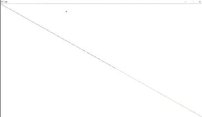

# Assignment - Framebuffer Objects



> "Back to rendering a single quad!"

# Resources to help

Some additional resources to help you through this assignment

| SDL2 related links                                    | Description                       |
| --------------------------------------------------    | --------------------------------- |
| [SDL API Wiki](https://wiki.libsdl.org/APIByCategory) | Useful guide to all things SDL2   |
| [My SDL2 Youtube Playlist](https://www.youtube.com/playlist?list=PLvv0ScY6vfd-p1gSnbQhY7vMe2rng0IL0) | My Guide for using SDL2 in video form.   |
| [Lazy Foo](http://lazyfoo.net/tutorials/SDL/)         | Great page with written tutorials for learning SDL2. Helpful setup tutorials for each platform. |
| [Lazy Foo - Handling Key Presses](https://lazyfoo.net/tutorials/SDL/04_key_presses/index.php) | Useful tutorial for learning how to handle key presses | 

| OpenGL related links                                | Description                       |
| --------------------------------------------------  | --------------------------------- |
| [My OpenGL Youtube Series](https://www.youtube.com/playlist?list=PLvv0ScY6vfd9zlZkIIqGDeG5TUWswkMox) | My video series for learning OpenGL |
| [docs.gl](http://docs.gl)                           | Excellent documentation to search for OpenGL commands with examples and description of function parameters   |
| [learnopengl.com](https://learnopengl.com)          | OpenGL 3.3+ related tutorial and main free written resource for the course   |


| C++ related links                                   | Description                       |
| --------------------------------------------------  | --------------------------------- |
| [My C++ Youtube Series](https://www.youtube.com/playlist?list=PLvv0ScY6vfd8j-tlhYVPYgiIyXduu6m-L) | My video series playlist for learning C++ |
| [cppreference](https://en.cppreference.com/w/)      | Definitive, more encyclopedic guide to C++ (less beginner focused, but excellent technically) |
| [cplusplus.com](http://www.cplusplus.com)           | Nice website with examples and tutorials geared more for beginners, reference has lots of examples, and the tutorial page is a great starting point |
| [learncpp.com](https://www.learncpp.com/)           | Handy page for learning C++ in tutorial form   |


- Assignment related 
	- https://learnopengl.com/Advanced-OpenGL/Framebuffers
		- Specific resource on rendering framebuffers
	- https://www.opengl.org/discussion_boards/showthread.php/183185-Multiple-FBOs-or-attachment-swapping
		- Information on multiple Framebuffer objects
	- http://www.opengl-tutorial.org/intermediate-tutorials/tutorial-14-render-to-texture/
		- Another tutorial with cool framebuffer object post-processing effects
	- https://www.haroldserrano.com/blog/understanding-opengl-objects
		- A nice refresher on OpenGL Objects: 
    - https://www.youtube.com/watch?v=KuXjwB4LzSA
        - Excellent lesson from 3Blue1Brown illustrating the idea of a convolution.

# Description

In this assignment, you will be working with framebuffers. Effectively, you are going to redraw the scene (taken care of for you) and apply post-processing effects (your task) to our scene using a framebuffer object.

## Part 1 - C++/glsl Refresh?

### Task 1 - Composition in C++

Today we are introducing the 'Framebuffer' class. If you remember previously, we discussed in our C++ refresh the idea of inheritance where one class builds off of another. We call this a 'is-a' relationship, because one class 'is a' descencdent of another, or can act as another class.

Another way to build relationships between classes is what is known as a 'has-a` relationship. This is the idea that a member variable is another instance of a class. In this way we can also compose a more complex class with many instances of other objects.

```cpp
class FrameBuffer{
// ...
// ...
// ...
private:
	Shader* m_shader; // A FrameBuffer 'has-a' Shader.
};

```

## Part 1 - Post-processing (Using a Framebuffer)


Today the trick is that we are adding a framebuffer to our renderer. We are going to be drawing to our own custom framebuffer, as opposed to using the default OpenGL framebuffer. By drawing to our own framebuffer, we then have the ability to change what the final output of the scene is.

So the steps are:

1. We setup our own framebuffer
2. We draw our scene as normal (using our objects, any shaders, etc.), but direct the output to our framebuffer
3. Then we bind to a new shader([./shaders/fboVert.glsl](./shaders/fboVert.glsl) and [./shaders/fboVert.glsl](./shaders/fboVert.glsl)) which will be used to draw our next object.
	- The next object we are drawing is a 'quad'
	- We will then texture this quad with the framebuffer from step 2.

Since we are drawing to the framebuffer, this buffer stores all of our pixels. We can then manipulate the pixels stored in a texture within our  fragment shader to create a post processing effect.

**Assignment Goal:** Render the terrain as normal, but apply a post-processing 'kernel'. https://learnopengl.com/Advanced-OpenGL/Framebuffers provides some samples of how to post-process the final scene by inverting the image, blurring the image, or otherwise performing edge detection.

(Note: The image of the framebuffer is from https://developer.apple.com/library/archive/documentation/3DDrawing/Conceptual/OpenGLES_ProgrammingGuide/DrawingWithOpenGLES/DrawingWithOpenGLES.html)

### Vertex Shader in a glance

This is what is given today.

```c
// ==================================================================
#version 330 core
// Read in our attributes stored from our vertex buffer object
// We explicitly state which is the vertex information
// (The first 3 floats are positional data, we are putting in our vector)
layout(location=0)in vec3 position; 
layout(location=1)in vec2 texCoord; // Our second attribute - texture coordinates.

// If we have texture coordinates we can now use this as well
out vec2 v_texCoord;

void main()
{

    gl_Position = vec4(position.x,position.y,0.0f, 1.0f);

    // Store the texture coordinaets which we will output to
    // the next stage in the graphics pipeline.
    v_texCoord = texCoord;
}
// ==================================================================

```

### Fragment Shader in a glance

This is what is given today.

```c
// ====================================================
#version 330 core

// ======================= uniform ====================
// If we have texture coordinates, they are stored in this sampler.
uniform sampler2D u_DiffuseMap; 

// ======================= IN =========================
in vec2 v_texCoord; // Import our texture coordinates from vertex shader

// ======================= out ========================
// The final output color of each 'fragment' from our fragment shader.
out vec4 FragColor;

void main()
{
    // Store our final texture color
    vec3 diffuseColor;
    diffuseColor = texture(u_DiffuseMap, v_texCoord).rgb;
        
    FragColor = vec4(diffuseColor,1.0);
}
// ==================================================================
```

## Interaction

In order to prove that the scene is being drawn to a texture and then rendered on a quad, you can hold the <kbd>w</kbd> key to see the wireframe view of the scene.


# Submission/Deliverables

### Submission

- Commit all of your files to github, including any additional files you create.
- Do not commit any binary files unless told to do so.
- Do not commit any 'data' files generated when executing a binary.

### Deliverables

1. Create one post-processing effect. Some samples are provided at: https://learnopengl.com/Advanced-OpenGL/Framebuffers

# Going Further

What is that, you finished Early? Did you enjoy this lab? Here are some (optional) ways to further this assignment.

- Create a second framebuffer with a second set of shaders, such that pressing the '1' and '2' numbers flips between the different effects in your scene.
	- Note, you can implement this with one framebuffer, and have user input passed in through a uniform variable.

# F.A.Q. (Instructor Anticipated Questions)

1. Q: Is this a relatively short assignment?
2. A: Yes -- go work on your final project.

# Found a bug?

If you found a mistake (big or small, including spelling mistakes) in this lab, kindly send me an e-mail. It is not seen as nitpicky, but appreciated! (Or rather, future generations of students will appreciate it!)

- Fun fact: The famous computer scientist Donald Knuth would pay folks one $2.56 for errors in his published works. [[source](https://en.wikipedia.org/wiki/Knuth_reward_check)]
- Unfortunately, there is no monetary reward in this course :)
