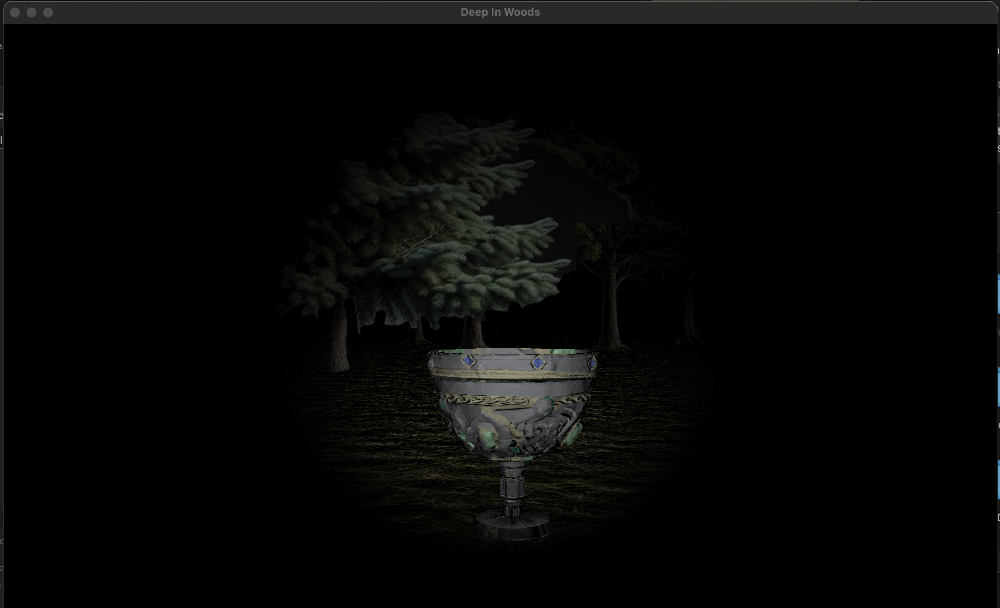

## Title: Deep In Woods
* This is a game of a person in the woods with a flashlight in hand that only lasts for 30 seconds. 
* The main objective is to find the target "Chalice". 
* Your flashlight will run out of battery over time. Collect batteries on the group to extend its duration. Every battery will extend light the duration for another 30 seconds. 
* It is game over if you cannot collect a battery within 10 seconds after your flashlight run out of battery.
* Note that it is a large map (40X40), and the game is quite challenging. Enjoy~!

## Techniques used 
* Phong Lighting
* Texture
* Billboarding
* Instancing
* Collision calculation

## YouTube Link: [https://youtu.be/G571i72WS6E](https://youtu.be/G571i72WS6E)

## Edit this line: Put a few screenshots of your project here (see deliverables).

* Name and partners name(At most teams of 2 folks total)
  * Team member 1: Lingxin Ma
  * Team member 2: Cuiqi Zheng
* How many hours did it take you to complete this final project? 20
* Did you collaborate or share ideas with any other students/TAs/Professors?
* Did you use any external resources? 
  * Note it is fair to utilize some tutorials--cite them here. You **must** add your own personal touch however!
  * [billboarding and geometry shader tutorial](https://ogldev.org/www/tutorial27/tutorial27.html)
  * [learnopengl instancing tutorial](https://learnopengl.com/Advanced-OpenGL/Instancing)
  * [tubosquid for blender obj](https://www.turbosquid.com/)
  * [grass texture](https://opengameart.org/content/3-seamless-grass-textures)
  * (Optional) What was the most interesting part of the Final Assignment? How could the instructor improve the final project?

### Rubric

<table>
  <tbody>
    <tr>
      <th>Points</th>
      <th align="center">Description</th>
    </tr>
    <tr>
      <td>(30%) Project Completion</td>
     <td align="left"><ul><li>(10%) Does the project compile and run.</li><li>Is it polished without any bugs (No weird visual artifacts).</li><li>(15%)Did you make a video?</li><li>(5%)Did you add a screenshot of your project to the repository?</li></ul></td>
    </tr>
    <tr>
      <td>(40%) Technical</td>
      <td align="left"><ul><li>Was the implementation of the project challenging?</li><li>Even if you followed a tutoral, it should not be trivial, and have some personal touch to it.</li><li>Did you have to organize/process a sufficient amount of data?</li><li>Was it clear you consulted some outside resources that go above and beyond the scope of this class</li></ul></td>
    </tr>
    <tr>
      <td>(30%) Creativity</td>
      <td align="left"><ul><li>How visually appealing is the scene?<ul><li>Note: There should be some 'wow' factor--instructors discretion is used here relative to previous projects.</li></ul></li><li>How original is the project<ul><li>Again, did you enhance a tutorial and do something unique or just go by the book?</li></ul></li></ul></td>
    </tr>
  </tbody>
</table>
